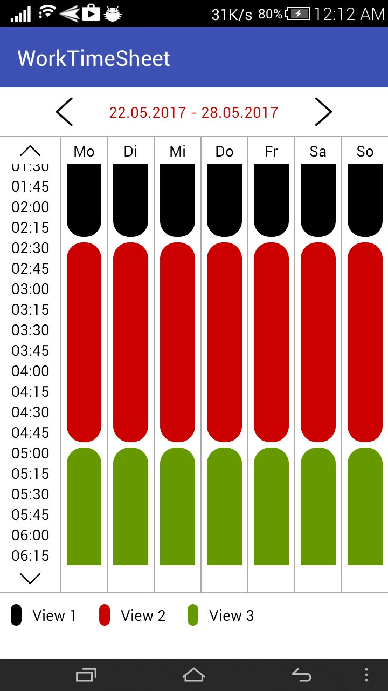

# Work-Time-Sheet
Work Time Sheet

[](https://jitpack.io/#hantrungkien/Work-Time-Sheet)

<a></a>

### install:

**via JitPack (to get current code)**

project/build.gradle
````gradle
allprojects {
    repositories {
        maven { url "https://jitpack.io" }
    }
}
````
module/build.gradle
````gradle
compile 'com.github.hantrungkien:Work-Time-Sheet:1.1.3'
````

#### How to use:

````xml
<htkien.timetable.WorkTimeSheet
 android:id="@+id/work_time_sheet"
 android:layout_width="match_parent"
 android:layout_height="match_parent" />
````

See [MainActivity.java](https://github.com/hantrungkien/Work-Time-Sheet/blob/master/app/src/main/java/htkien/worktimesheet/MainActivity.java) to know how to use

````Java
 @Override
    public void onWeekCalendarSelected(int position) {
        mWorkTimeSheet.setContentMonday(0, 10, 10, 20, 20, 30);
        mWorkTimeSheet.setContentTuesday(0, 10, 10, 20, 20, 30);
        mWorkTimeSheet.setContentWednesday(0, 10, 10, 20, 20, 30);
        mWorkTimeSheet.setContentThurday(0, 10, 10, 20, 20, 30);
        mWorkTimeSheet.setContentFriday(0, 10, 10, 20, 20, 30);
        mWorkTimeSheet.setContentSaturday(0, 10, 10, 20, 20, 30);
        mWorkTimeSheet.setContentSunday(0, 10, 10, 20, 20, 30);
    }
````

### Contribution

If you've found an error, please file an issue.

Patches and new samples are encouraged, and may be submitted by forking this project and submitting a pull request through GitHub.
